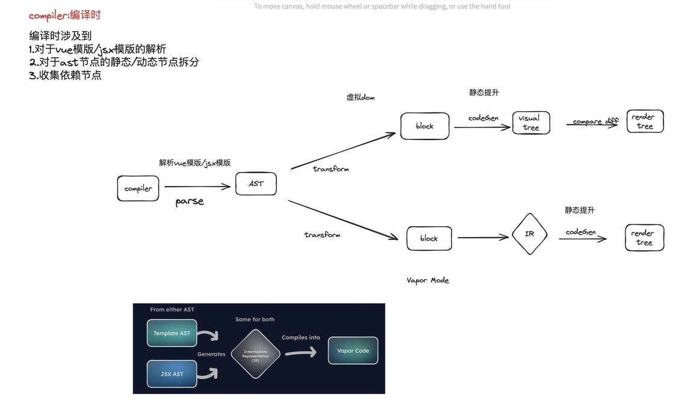

# 关于Vapor Mode现阶段进度的理解总结--第一章

前言：本文在介绍vapor mode之前，第一章会先介绍明确最基本的三元论，是什么？为什么？怎么做？

未来几章会逐步介绍“怎么做”阶段，以及各个大佬的进度，待解决的问题，同时最后思考，我们能做些什么参与到相关开源项目中。

## Vapor Mode是什么

熟悉vue的都知道，vue的渲染原理借助了一个核心概念--虚拟dom，有了虚拟dom我们在更新节点时能够实现对diff节点的收集和相关依赖的收集，以便于下一次的渲染速度能够得到提升。

于此同时虚拟dom本身并不是dom，我们在做节点渲染时**往往需要去生成对应的虚拟节点，通过比对新旧dom树去替换待更新的dom**，这种过程从原理上来说是存在性能消耗的。

于是vue推出的vapor mode的想法，就是直接对dom进行操作，直接修改对应的节点，而不是生成虚拟dom去操作。

## 为什么推出Vapor

我把vue关于虚拟dom层面的优化理解的为三个阶段：全量更新虚拟dom->增量查询待更新的虚拟dom->不再使用虚拟dom（vapor mode）

前面全量更新->增量更新的过程，其实主要就是vue2->vue3过程中所做的工作。

### Vue2->Vue3所做的优化

在Vue 2中，组件的更新机制依赖于**全量重新渲染组件树来识别和应用变更**。这意味着即使只有少数几个节点需要更新，Vue 2也会收集整个组件的依赖，重新生成整个组件的虚拟DOM树，并通过对比新旧虚拟DOM树来确定需要更新的具体部分。这个过程虽然简化了更新逻辑，但在处理大型或复杂组件树时可能会引入不必要的性能开销，**因为它需要重新计算整个组件树，而不是只关注变化的部分**。

Vue 3通过引入编译时优化和更细粒度的响应式系统来解决这一问题。利用编译时的**静态分析**，Vue 3能够预先确定组件模板中哪些部分可能会发生变化，从而在运行时精确地跟踪和更新这些变化的部分。这种增量更新机制显著提高了更新效率，因为**它避免了对未更改节点的无谓计算和DOM操作。**

vue2过渡到vue3的实现方法之一：**随着ES6的发展，Vue的响应式系统从Vue 2的基于Object.defineProperty的属性访问拦截，升级到Vue 3的基于Proxy的对象拦截。这个变化使得依赖收集和变更通知的机制从对单个属性的操作转变为可以直接作用于整个对象，提高了响应式系统的性能和灵活性。此外，Proxy的使用允许Vue 3将变更检测的粒度从属性级别提升到对象级别，从而简化了组件和数据更新的复杂度\*\***

#### vue3中使用proxy劫持整个对象相较于object.defineProperty的优势是什么

1. object.defineProperty 收集/触发依赖变更时，需要通过遍历对象的方式，收集getter/setter，然后在更新时查找出具体是哪个/哪些依赖存在变化，然后触发对象getter/setter进行增量或是全量的更新。同时面临对象的`push`、`pop`、`shift`、`unshift`、`splice`、`sort`和`reverse`等一系列操作时，为了保持响应式，需要手动触发对象getter/setter
2. 使用proxy收集/触发依赖变更时，无需遍历对象收集getter/setter，proxy的handler对象直接能够对对象的一系列操作进行劫持。在面临更多的对象的`push`、`pop`、`shift`、`unshift`、`splice`、`sort`和`reverse`等操作时，无需手动触发对象的setter/setter

#### Vue3的节点diff优化

同时在vue3中，为了更好的优化渲染过程还会存在虚拟dom算法层面的优化，**其中的一个比较核心的概念就是静态提升**。

vue2过渡到vue3的实现方法之二：**Vue从v2中收集组件树的所有相关资源生成虚拟树的过程，过渡到v3中通过babel解析vue模版识别出ast抽象语法树中的静态节点和动态节点的方式，通过复用静态节点，重点关注动态节点的变更的方式来重建虚拟树。从而实现编译时过程中diff性能的优化。**

所谓静态提升就是--这一识别并预处理那些在组件的多次渲染中不会改变的静态内容，将它们在编译时期提前转换为常量，以减少在组件每次更新时对这些静态内容的重复计算和渲染

静态提升涉及到的实施过程如下：

1. **解析模板（compiler-core）：** 将Vue模板（一个HTML-like的字符串）解析成AST。这一步涉及词法分析（tokenization）和语法分析（parsing），将模板字符串转换成AST节点。
2. **优化AST（compiler-core）：** 遍历AST，标记静态节点和静态根节点。这一步是优化的关键，它识别出哪些节点在组件的多次渲染中不会改变。静态节点可以在编译时直接转换成渲染函数中的常量，避免在每次渲染时的重新计算。
3. **代码生成（code-generation）：** 将优化后的AST转换成可执行的渲染函数代码。这一步涉及将AST节点转换为JavaScript代码，这些代码在执行时能够生成虚拟DOM树。

#### V3编译时优化的细节

在编译时优化过程中，v3新增了**block,fragment**这两个概念来辅助静态提升。

Block:包含静态节点和动态节点的vnode，编译阶段，会识别出静态节点；在组件更新时，只需要识别动态的节点的变化。在后续更新中复用静态节点，追踪动态节点重建虚拟树，实现对编译时的性能提升。

在编译时的过程中，AST的一些静态的常量如标签（
），表达式符号（=）等会被识别为静态资源，

而vue等一些内置指令会被识别为如**不同类型的block-动态节点**：v-bind、动态文本：slot、动态列表 v-for、条件渲染block：v-if 等

这些具体细节实现可能得自己看看源码。

fragment：为了方便开发者无需使用新增dom节点（
）来包裹对应的组件，，这样能减少dom树的构建，进而减少渲染过程中的压力

### V3->vapor mode的变化来源

由于虚拟树本身创建本身也会消耗性能，v3接下来的想法就是受solid.js的dom更新的启发-即直接更新dom，而无需生成对应的虚拟树，推出了Vapor Mode，具体solid具体实施细节可能需要接下来继续探索。接下来我主要是探讨一下我目前所知的Vapor相关进展。

## Vapor Mode怎么做

在现阶段的Vapor Mode中，我主要关注的是Vapor模式中Render阶段的改进细节：亦即Vue中compiler阶段，做了什么优化。

在V3过程中，我们会先生成虚拟dom，再处理完静态提升后，对待渲染的节点进行重建，同时对新旧dom树进行比对并替换，最终增量渲染dom树

在vapor mode中，编译时的工作解析过程，仍然继续使用v3点ast和block进行相关重建，唯一不同的是，为了取代虚拟dom，vapor通过引入IR（intermediate representation）的方式优化虚拟dom节点的渲染。

在Vapor mode中，block和相关节点解析成特定的IR端代码，然后再通过codegen生成对应的render树代码，具体过程如下所示：

- 在编译时的parse阶段，对vue template（html-like的代码片段）进行解析成ast
- 在编译时的transform阶段，对ast进行静态节点和动态节点划分，生成特定的block代码块
- 针对composition api的节点，使用虚拟dom的方式，通过比对新旧虚拟dom，重建生成渲染树
- 针对vapor节点，通过识别特定标识生成IR代码块，直接根据IR代码块，将特定的dom进行全量替换。

Ps：针对vapor mode中 ，我最关注的是，ast->Ir过程是如何实现的？

参考：

https://qiita.com/ubugeeei/items/73a2416fd46cfe6311a8

https://qiita.com/ubugeeei/items/b28a04a41348b6e49293

https://icarusgk.hashnode.dev/vue-3-vapor-mode

##
